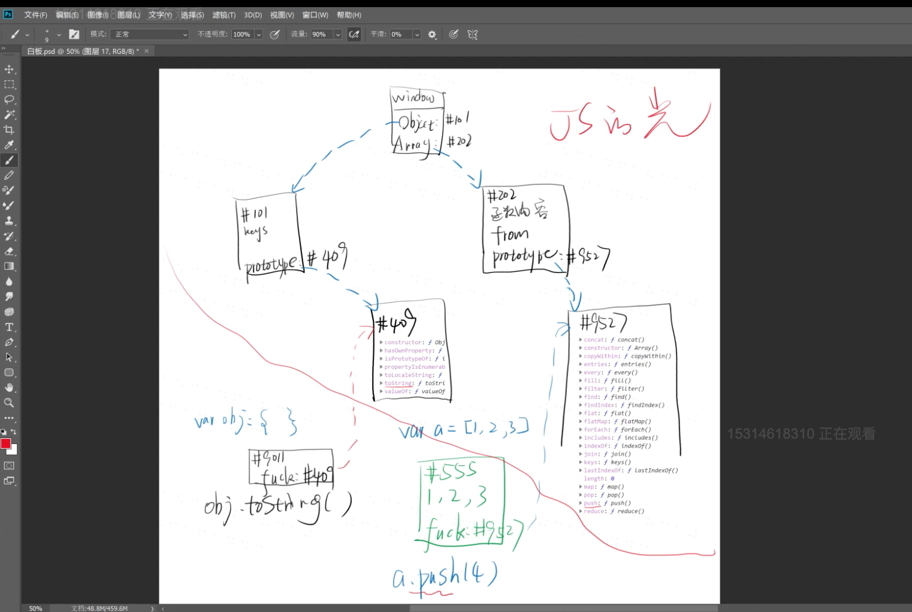
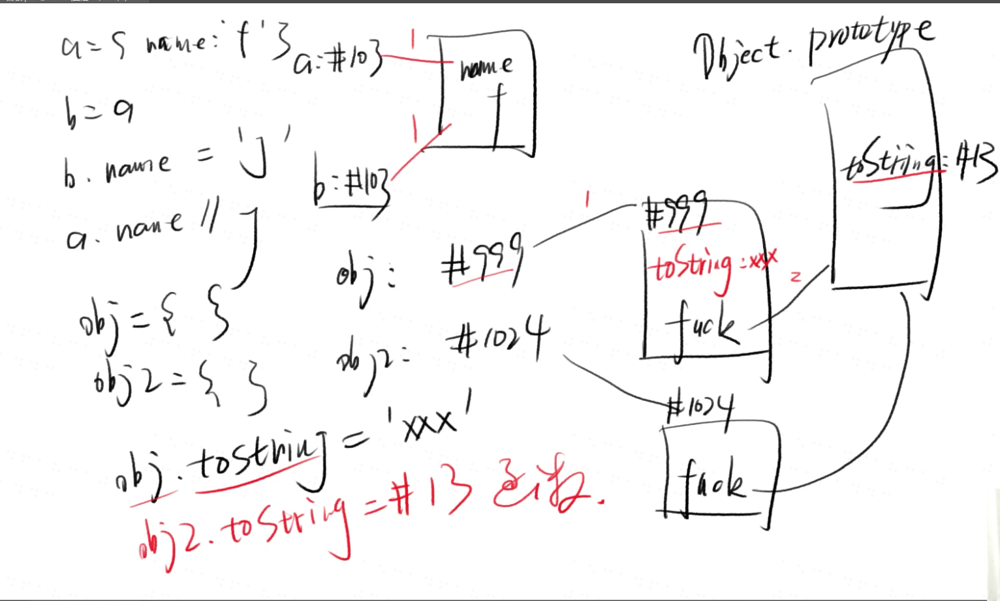
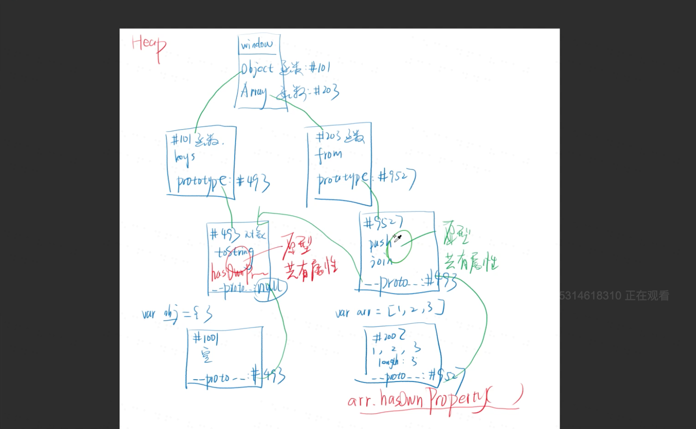

# 第二十一天

JS三座大山：1.this  2.原型  3.AJAX

----------
## 原型链

声明一个空对象以后，对象里面会出现一个隐藏属性，隐藏属性会指向这个对象的原型。__proto__

属性篡改时，当只有一层是可以被篡改的，但如果是两层调用，则无法被篡改。

xxx.prototype存储了xxx对象的共同属性，这就是原型。

prototype和__proto__的共同点是存着同一个地址，区别是prototype是挂在函数上的，而__proto__是挂在新生成的对象上的。

三次调用
