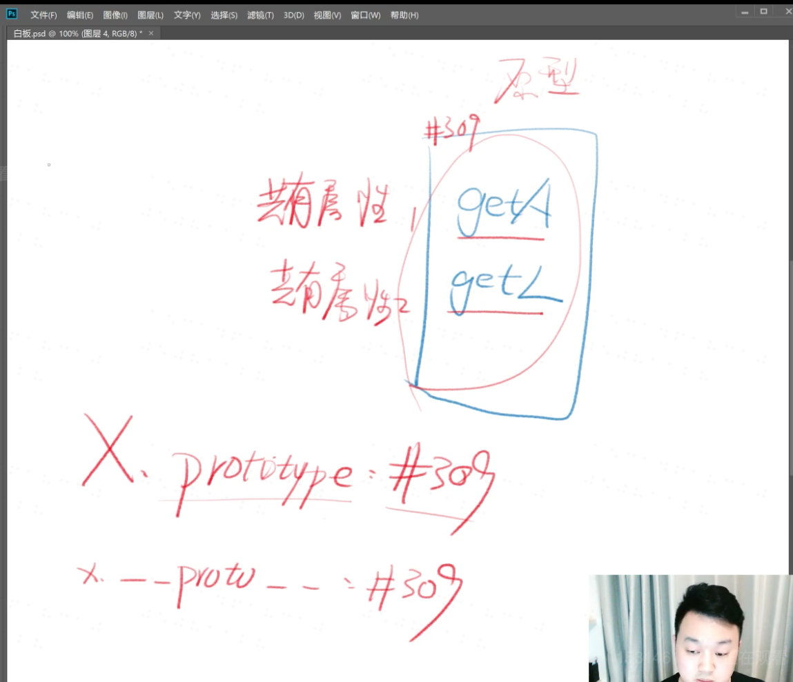

# 对象的类

## 构造函数
可以构造出对象的函数，就叫构造函数

函数f中会有prototype，这其中又包含有constructor和__proto__，constructor等于函数自身.

用new操作符创建一个新的对象。

new X 自动完成了四件事
1. 自动创建了空对象
2. 自动为空对象关联原型，原型地址指定为X.prototype
3. 自动将空对象作为this关键字运行构造函数
4. 自动return this

关于构造函数X
1. X函数本身负责给新对象本身添加属性
2. X.prototype负责给新对象保存共用属性

代码规范：
1. 所有的构造函数，首字母都要大写，所有被构造出来的对象，首字母小写
2. new后面的函数，使用名词形式
3. 其他函数一般使用动词开头

