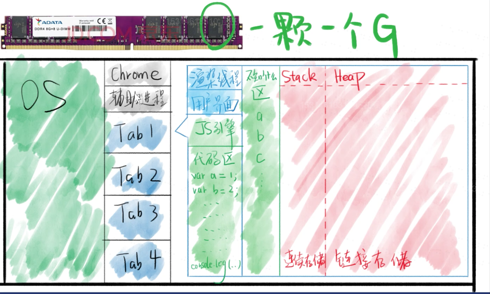
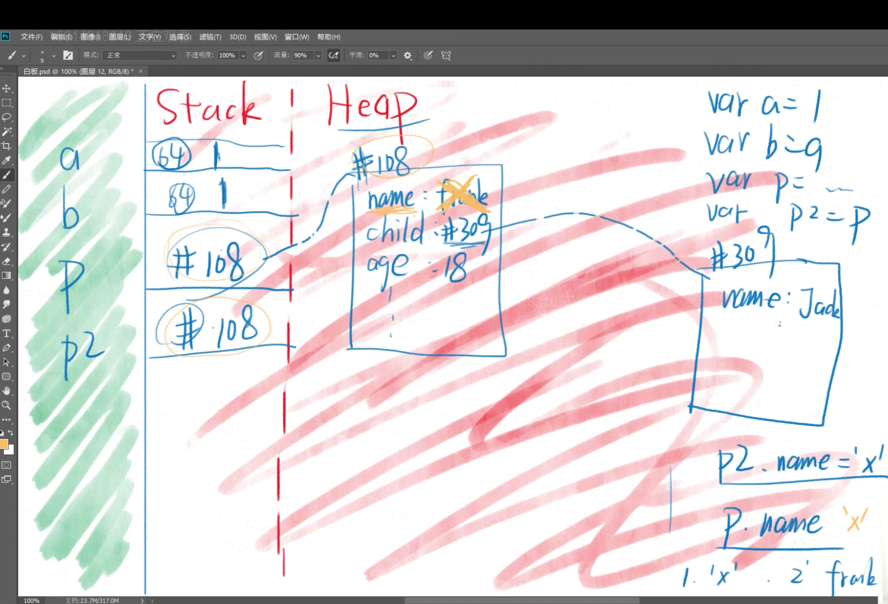
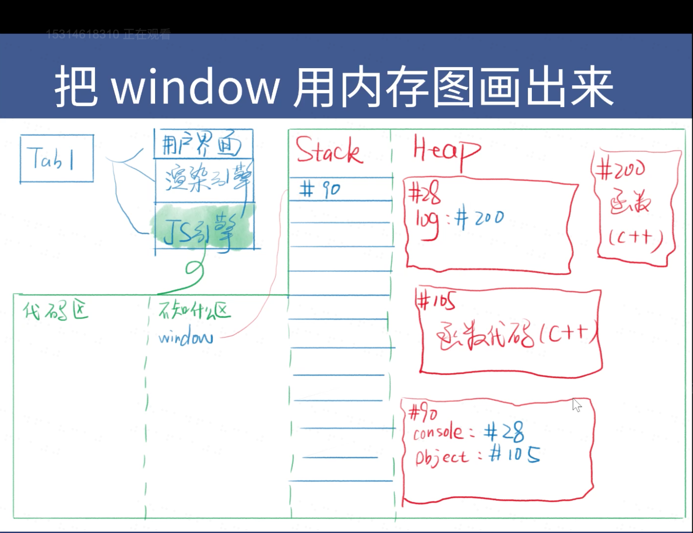
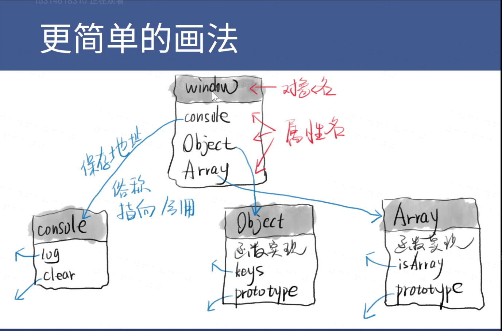

# 第二十天

一切都运行在内存里。

浏览器做的事情，下载html，解析html，下载css，解析css，渲染页面，下载js，解析js，执行js。

浏览器功能模块：用户界面、渲染引擎、js引擎、存储等。

不同的功能模块都处于不同的线程内，比进程更小。

js是单线程的。

js如果需要进行渲染，就需要进行跨线程通信，需要通过google浏览器进行，它会有一个接口。跨线程通信会慢一点，所以DOM操作会慢。

------------

## JS引擎

Chrome用的是V8引擎，C++编写
Node.js用的是V8引擎。

JS引擎的主要作用：
* 编译：把JS代码翻译为机器能执行的字节码或机器码
* 优化：改写代码，使其更高效
* 执行：执行上面的字节码或机器码
* 垃圾回收：把JS用完的内存回收，方便之后再次使用

重点讲解代码的执行。

代码执行之前浏览器做的准备工作：
* 提供API：window / document / setTimeout
* 我们将这些功能称为运行环境runtime env
* 一旦把js放进页面，就开始执行js
* js代码在内存中加载和运行

瓜分内存的过程：

红色区域专门用来存放数据，目前只研究这个区域；

红色区域并不存在变量名，变量名在前面的绿色区域内，每种浏览器的分配规则不一样，上图区域并不完整，还没画[调用栈]和[任务队列]等区域。

stack栈区的特点是数据是顺序存放；
heap堆区的特点是数据是随机存放。

数据分为两种，对象和非对象（数字、字符串、布尔值），非对象都存在stack区，对象都存在heap区，=号总是会把右边的东西复制给左边，不存在什么传值和传址的问题。

地址和值是不矛盾的。

-----------

js的原型

window是作为默认的全局对象存在，所有在非闭包中定义的变量，声明的函数，以及在闭包中未定义就使用的变量，都会默认作为window的属性使用。简单地可以理解为window是作为作用域的最顶层存在，以上的方式都是在作用域的最顶层定义变量，也就是在window下定义变量。

window在js引擎上的存放方式。

指向/引用其实就是保存地址。

第一个字母大写的对象时，对象中会有protoTpye属性 。

window对象和window变量是两个东西。window变量是一个容器，存放window对象的地址，window对象是heap里的一堆数据。
